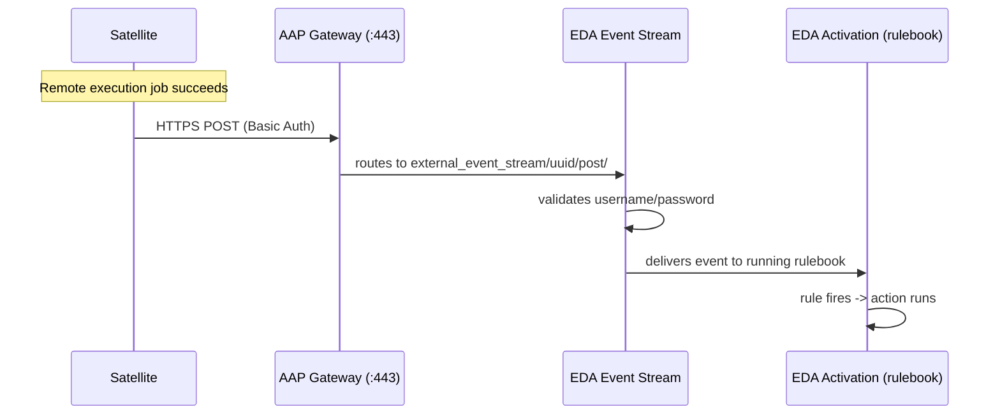
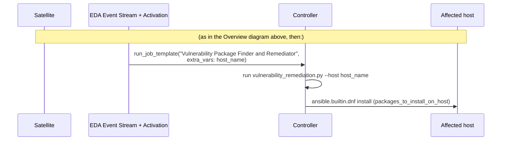

# Configuring Satellite -> AAP EDA Webhooks (manual, offline-safe, CLI-only)

These instructions are for manually wiring a Red Hat Satellite webhook to
an Event-Driven Ansible (EDA) Event Stream in AAP, on systems that are
isolated from the internet (no API/SSH access from outside the lab
network). Every step below is done directly on the Satellite and AAP
hosts, via SSH/`curl`/`hammer` only - no web UI interaction required.

Every JSON POST body below is built by a small Python script written to a
**file** via a single-quoted heredoc (so the shell never tries to
interpret anything inside it), then sent with `curl -d @<file>`. This
avoids the nested-quoting breakage you get from embedding multi-line
`python3 -c "..."` JSON-building code directly inside `$(...)` command
substitutions.

Adjust hostnames (`aap1.lab`, `satellite.lab`) and the `aap1-user` login
to match your environment.

## Overview



Two secrets are involved and must not be confused:

- **SSH deploy key** (EDA credential type "Source Control") - only lets
  EDA `git clone` your rulebook repo.
- **Basic Auth username/password** (EDA credential type "Basic Event
  Stream") - what Satellite sends on every call, and what EDA checks.
  This is the one that matters for security.

## Part A - On the AAP host, as `aap1-user` (CLI only, via the EDA API)

All commands in this section run locally on `aap1` as `aap1-user`, and
talk to the EDA REST API at `https://localhost/api/eda/v1/`. No sudo/root
is required (the app-level `admin` login is separate from the OS user).

### 0. Set up shared variables and helpers

```bash
export EDA_API="https://localhost/api/eda/v1"
export EDA_AUTH="admin:<your-aap-admin-password>"   # AAP application admin, not aap1-user
export REPO_URL="ssh://aap1-user@localhost/home/aap1-user/git/satellite-webhook.git"
mkdir -p /tmp/eda-setup

# GET helper - no request body, safe as a one-liner
eda_get() {
  curl -sk -u "$EDA_AUTH" -X GET "$EDA_API$1"
}

# POST/PATCH helper - reads the request body from a FILE, never from a
# shell-quoted string, so there's no quoting to get wrong.
eda_send() {
  local method="$1" path="$2" payload_file="$3"
  curl -sk -u "$EDA_AUTH" -X "$method" "$EDA_API$path" \
    -H "Content-Type: application/json" -d @"$payload_file"
}

# Extract a single field from JSON on stdin, e.g.: cat foo.json | jq_field '["id"]'
# Prints the raw response and exits non-zero instead of a bare KeyError
# if the field is missing (e.g. the API returned an error/validation
# response instead of the object you expected - usually means the named
# resource already exists, or the request payload was rejected).
jq_field() {
  python3 -c '
import sys, json
raw = sys.stdin.read()
data = json.loads(raw)
expr = sys.argv[1]
try:
    print(eval("data" + expr))
except (KeyError, IndexError, TypeError):
    sys.stderr.write("jq_field: field " + expr + " not found in response:\n" + raw + "\n")
    sys.exit(1)
' "$1"
}
```

(`jq_field '["id"]'` reads like a Python dict lookup - shown that way in
each step below so you can see exactly what's being pulled out.)

**Before creating any named resource below (credential, Project, Event
Stream, Activation), check whether it already exists first** - every
`POST .../` call in this doc is only safe to re-run if you skip it when
the resource is already there (these EDA endpoints are not idempotent by
name; re-posting the same name usually fails with a uniqueness error that
has no `id` field, which is exactly the `jq_field` failure mode above).
The general pattern, reusable for any endpoint/name pair:

```bash
# ensure_id <endpoint-path> <exact-name>
ensure_id() {
  eda_get "$1?name=$(python3 -c "import urllib.parse,sys; print(urllib.parse.quote(sys.argv[1]))" "$2")" \
    | python3 -c "import sys,json; r=json.load(sys.stdin)['results']; print(r[0]['id'] if r else '')"
}
```

e.g. `ensure_id /eda-credentials/ "Self-hosted repo deploy key"` prints
the id if it exists, or an empty string if it doesn't. Use it before each
create step below: if it prints a value, use that as the `*_ID` and skip
the `eda_send POST` call; if it's empty, proceed with creating it.

### 1. Create a rulebook and self-host it as a git repo EDA can sync from

```bash
mkdir -p ~/git
git init --bare ~/git/satellite-webhook.git
git -C ~/git/satellite-webhook.git symbolic-ref HEAD refs/heads/main

ssh-keygen -t ed25519 -f ~/.ssh/eda_project_deploy_key -N "" -C "eda-project-sync"
cat ~/.ssh/eda_project_deploy_key.pub >> ~/.ssh/authorized_keys
chmod 600 ~/.ssh/authorized_keys ~/.ssh/eda_project_deploy_key
ssh -n -o StrictHostKeyChecking=accept-new -i ~/.ssh/eda_project_deploy_key aap1-user@localhost true
```

Write and push the rulebook:

```bash
mkdir -p ~/satellite-webhook && cd ~/satellite-webhook

# EDA requires rulebooks to live in an 'extensions/eda/rulebooks/' or
# 'rulebooks/' directory within the project root - a file sitting at
# the repo root is silently not picked up (the project sync still
# reports import_state: completed, but with a non-fatal import_error
# and zero rulebooks found).
mkdir -p rulebooks
cat > rulebooks/satellite-webhook.yml <<'EOF'
---
- name: Satellite Remote Execution Webhook
  hosts: all
  sources:
    - ansible.eda.webhook:
        host: 127.0.0.1
        port: 5000
      name: satellite_webhook
  rules:
    - name: Log Satellite remote execution success
      condition: true
      action:
        debug:
          msg: "Received Satellite webhook: {{ event }}"
EOF

git init
git config user.name "aap1-user"
git config user.email "aap1-user@aap1.lab"
git add rulebooks/satellite-webhook.yml
git commit -m "Add satellite webhook rulebook"
git branch -M main
git remote add aap "$REPO_URL"
GIT_SSH_COMMAND="ssh -i ~/.ssh/eda_project_deploy_key -o IdentitiesOnly=yes" git push aap main
```

> The `ansible.eda.webhook` block is just a placeholder name - EDA swaps
> it out at runtime for its own delivery mechanism once the rulebook's
> source name (`satellite_webhook`) is linked to a real Event Stream via
> `source_mappings` in step 7. Don't worry about the host/port values.

### 2. Create the SCM (Source Control) credential

```bash
SCM_CRED_TYPE_ID=$(eda_get "/credential-types/?name=Source%20Control" | jq_field "['results'][0]['id']")
echo "SCM_CRED_TYPE_ID=$SCM_CRED_TYPE_ID"

cat > /tmp/eda-setup/build_scm_cred.py <<'PYEOF'
import json, os
print(json.dumps({
    "name": "Self-hosted repo deploy key",
    "credential_type_id": int(os.environ["SCM_CRED_TYPE_ID"]),
    "organization_id": 1,
    "inputs": {"ssh_key_data": open(os.path.expanduser("~/.ssh/eda_project_deploy_key")).read()},
}))
PYEOF

SCM_CRED_TYPE_ID="$SCM_CRED_TYPE_ID" python3 /tmp/eda-setup/build_scm_cred.py > /tmp/eda-setup/scm_cred.json

SCM_CRED_ID=$(eda_send POST "/eda-credentials/" /tmp/eda-setup/scm_cred.json | jq_field "['id']")
echo "SCM_CRED_ID=$SCM_CRED_ID"
```

If you're re-running this after a partial failure, check first instead of
creating a duplicate:

```bash
eda_get "/eda-credentials/?name=Self-hosted%20repo%20deploy%20key" \
  | python3 -c "import sys,json; r=json.load(sys.stdin)['results']; print(r[0]['id'] if r else 'NONE')"
```

### 3. Create the EDA Project and wait for it to sync

```bash
cat > /tmp/eda-setup/build_project.py <<'PYEOF'
import json, os
print(json.dumps({
    "name": "Satellite Webhook Rulebooks",
    "url": os.environ["REPO_URL"],
    "eda_credential_id": int(os.environ["SCM_CRED_ID"]),
    "organization_id": 1,
}))
PYEOF

REPO_URL="$REPO_URL" SCM_CRED_ID="$SCM_CRED_ID" python3 /tmp/eda-setup/build_project.py > /tmp/eda-setup/project.json

PROJECT_ID=$(eda_send POST "/projects/" /tmp/eda-setup/project.json | jq_field "['id']")
echo "PROJECT_ID=$PROJECT_ID"

# Poll until the sync finishes
for i in $(seq 1 20); do
  STATE=$(eda_get "/projects/$PROJECT_ID/" | jq_field "['import_state']")
  echo "import_state=$STATE"
  [ "$STATE" = "completed" ] && break
  [ "$STATE" = "failed" ] && { echo "sync failed:"; eda_get "/projects/$PROJECT_ID/" | jq_field "['import_error']"; break; }
  sleep 2
done
```

If it fails with a branch mismatch, double-check the bare repo's default
branch (`git -C ~/git/satellite-webhook.git symbolic-ref HEAD`), then
resync:

```bash
cat > /tmp/eda-setup/sync_project.json <<EOF
{"name": "Satellite Webhook Rulebooks"}
EOF
eda_send POST "/projects/$PROJECT_ID/sync/" /tmp/eda-setup/sync_project.json
```

### 4. Look up the rulebook that was synced in

```bash
RULEBOOK_ID=$(eda_get "/rulebooks/?project_id=$PROJECT_ID" \
  | python3 -c "import sys,json; print([r['id'] for r in json.load(sys.stdin)['results'] if r['name']=='satellite-webhook.yml'][0])")
echo "RULEBOOK_ID=$RULEBOOK_ID"
```

### 5. Create the Basic Auth ("Basic Event Stream") credential

```bash
BASIC_CRED_TYPE_ID=$(eda_get "/credential-types/?name=Basic%20Event%20Stream" | jq_field "['results'][0]['id']")
echo "BASIC_CRED_TYPE_ID=$BASIC_CRED_TYPE_ID"

WEBHOOK_USER="satellite-webhook"
WEBHOOK_PASS=$(python3 -c "import secrets; print(secrets.token_urlsafe(24))")

cat > /tmp/eda-setup/build_basic_cred.py <<'PYEOF'
import json, os
print(json.dumps({
    "name": "Satellite Webhook Basic Auth",
    "credential_type_id": int(os.environ["BASIC_CRED_TYPE_ID"]),
    "organization_id": 1,
    "inputs": {
        "username": os.environ["WEBHOOK_USER"],
        "password": os.environ["WEBHOOK_PASS"],
    },
}))
PYEOF

BASIC_CRED_TYPE_ID="$BASIC_CRED_TYPE_ID" WEBHOOK_USER="$WEBHOOK_USER" WEBHOOK_PASS="$WEBHOOK_PASS" \
  python3 /tmp/eda-setup/build_basic_cred.py > /tmp/eda-setup/basic_cred.json

BASIC_CRED_ID=$(eda_send POST "/eda-credentials/" /tmp/eda-setup/basic_cred.json | jq_field "['id']")
echo "BASIC_CRED_ID=$BASIC_CRED_ID"
echo "Save these - Satellite's webhook needs the identical username/password:"
echo "  username: $WEBHOOK_USER"
echo "  password: $WEBHOOK_PASS"
```

### 6. Create the Event Stream and capture its URL

```bash
cat > /tmp/eda-setup/build_event_stream.py <<'PYEOF'
import json, os
print(json.dumps({
    "name": "Satellite Remote Execution Webhook",
    "eda_credential_id": int(os.environ["BASIC_CRED_ID"]),
    "organization_id": 1,
}))
PYEOF

BASIC_CRED_ID="$BASIC_CRED_ID" python3 /tmp/eda-setup/build_event_stream.py > /tmp/eda-setup/event_stream.json

EVENT_STREAM_ID=$(eda_send POST "/event-streams/" /tmp/eda-setup/event_stream.json | jq_field "['id']")
EVENT_STREAM_URL=$(eda_get "/event-streams/$EVENT_STREAM_ID/" | jq_field "['url']")

echo "EVENT_STREAM_ID=$EVENT_STREAM_ID"
echo "EVENT_STREAM_URL=$EVENT_STREAM_URL"
```

`EVENT_STREAM_URL` is the exact value Satellite's webhook will target
(looks like `https://.../api/eda/v1/external_event_stream/<uuid>/post/`).

### 7. Create the Rulebook Activation

```bash
DE_ID=$(eda_get "/decision-environments/?name=Default%20Decision%20Environment" | jq_field "['results'][0]['id']")
echo "DE_ID=$DE_ID"

RULEBOOK_HASH=$(eda_get "/rulebooks/$RULEBOOK_ID/" \
  | python3 -c "import sys,json,hashlib; print(hashlib.sha256(json.load(sys.stdin)['rulesets'].encode()).hexdigest())")
echo "RULEBOOK_HASH=$RULEBOOK_HASH"

cat > /tmp/eda-setup/build_activation.py <<'PYEOF'
import json, os
source_mappings = json.dumps([{
    "source_name": "satellite_webhook",
    "event_stream_id": int(os.environ["EVENT_STREAM_ID"]),
    "event_stream_name": "Satellite Remote Execution Webhook",
    "rulebook_hash": os.environ["RULEBOOK_HASH"],
}])
print(json.dumps({
    "name": "Satellite Webhook Activation",
    "rulebook_id": int(os.environ["RULEBOOK_ID"]),
    "decision_environment_id": int(os.environ["DE_ID"]),
    "organization_id": 1,
    "eda_credentials": [int(os.environ["BASIC_CRED_ID"])],
    "is_enabled": True,
    "source_mappings": source_mappings,
}))
PYEOF

EVENT_STREAM_ID="$EVENT_STREAM_ID" RULEBOOK_HASH="$RULEBOOK_HASH" RULEBOOK_ID="$RULEBOOK_ID" \
  DE_ID="$DE_ID" BASIC_CRED_ID="$BASIC_CRED_ID" \
  python3 /tmp/eda-setup/build_activation.py > /tmp/eda-setup/activation.json

ACTIVATION_ID=$(eda_send POST "/activations/" /tmp/eda-setup/activation.json | jq_field "['id']")
echo "ACTIVATION_ID=$ACTIVATION_ID"

# Poll until it's running
for i in $(seq 1 20); do
  STATUS=$(eda_get "/activations/$ACTIVATION_ID/" | jq_field "['status']")
  echo "status=$STATUS"
  [ "$STATUS" = "running" ] && break
  sleep 3
done
```

## Part B - On the Satellite host (CLI only, via `hammer`)

Run as root (`sudo -i`) on `satellite.lab`.

### 1. Create the custom JSON webhook template

The built-in "Webhook Template - Payload Default" throws
`undefined method '#id'` for remote-execution events, and the other
built-in template only emits human-readable comments, not JSON - you
need a custom one:

```bash
cat > /tmp/satellite-remote-execution-host-job-json.erb <<'EOF'
<%#
name: Satellite Remote Execution Host Job JSON
description: JSON payload for actions.remote_execution.run_host_job_succeeded.event.foreman
snippet: false
model: WebhookTemplate
-%>
<%=
payload({
  host_name: @object.host_name,
  host_id: @object.host_id,
  job_invocation_id: @object.job_invocation_id,
  task_label: @object.task.label,
  task_state: @object.task.state,
  task_result: @object.task.result,
  task_started_at: @object.task.started_at,
  task_ended_at: @object.task.ended_at
})
-%>
EOF

TEMPLATE_CONTENT=$(cat /tmp/satellite-remote-execution-host-job-json.erb)
hammer webhook-template create \
  --name "Satellite Remote Execution Host Job JSON" \
  --template "$TEMPLATE_CONTENT" \
  --snippet false
```

### 2. Create the Webhook

> Fetch `EVENT_STREAM_URL`/`WEBHOOK_USER`/`WEBHOOK_PASS` fresh right
> before running this, rather than reusing values noted down earlier -
> the Event Stream's URL/UUID can change (observed in practice after
> the associated Basic Auth credential was touched), and a stale URL
> fails with `{"detail":"bad uuid specified"}` from EDA. If you hit
> that error, re-fetch the current URL via
> `curl -sk -u "$EDA_AUTH" "$EDA_API/event-streams/?name=Satellite%20Remote%20Execution%20Webhook"`
> and `hammer webhook update --id <id> --target-url "<fresh url>"`.

```bash
hammer webhook create \
  --name "AAP Event Driven Ansible Webhook" \
  --target-url "<EVENT_STREAM_URL from Part A step 6>" \
  --http-method POST \
  --http-content-type "application/json" \
  --event "actions.remote_execution.run_host_job_succeeded" \
  --webhook-template "Satellite Remote Execution Host Job JSON" \
  --user "<WEBHOOK_USER from Part A step 5>" \
  --password "<WEBHOOK_PASS from Part A step 5>" \
  --verify-ssl false \
  --enabled true
```

> Important gotcha hit during setup: the event value has **no**
> `.event.foreman` suffix on input even though `hammer webhook info`
> displays it with that suffix - use
> `actions.remote_execution.run_host_job_succeeded` exactly.

## Part C - Verify end-to-end (CLI only)

**1. Trigger a remote execution job on Satellite:**

```bash
hammer job-invocation create \
  --job-template "Run Command - Ansible Default" \
  --search-query "name = <hostname>" \
  --inputs "command=echo webhook-test"
```

**2. Check the event stream/activation counters on the AAP host** (as
`aap1-user`, reusing the helpers from Part A step 0):

```bash
eda_get "/event-streams/$EVENT_STREAM_ID/" \
  | python3 -c "import sys,json; d=json.load(sys.stdin); print(d['events_received'], d['last_event_received_at'])"

eda_get "/activations/$ACTIVATION_ID/" | jq_field "['ruleset_stats']"
```

`events_received` should have incremented and `last_event_received_at`
should be current.

**3. See the actual received payload** (activation instance logs):

```bash
INSTANCE_ID=$(eda_get "/activations/$ACTIVATION_ID/" | python3 -c "import sys,json; print(json.load(sys.stdin)['instances'][0])")
eda_get "/activation-instances/$INSTANCE_ID/logs/" | tail -c 2000
```

You should see a line like:

```
Received Satellite webhook: {'payload': {'host_name': ..., 'task_result': 'success', ...}, 'meta': {...}}
```

## Troubleshooting notes (from real issues hit during setup)

- **Project `import_state: completed` but the rulebook lookup fails
  with 0 results** - check the Project's `import_error` field (it's
  non-fatal, so `import_state` still shows `completed`):
  `curl -sk -u "$EDA_AUTH" "$EDA_API/projects/<id>/" | python3 -c "import sys,json; print(json.load(sys.stdin)['import_error'])"`.
  If it says something like `"The 'extensions/eda/rulebooks' or
  'rulebooks' directory doesn't exist within the project root"`, the
  rulebook file needs to live inside a `rulebooks/` subdirectory of the
  repo, not at the repo root - EDA silently finds zero rulebooks
  otherwise. Fixed in Part A step 1 above (`rulebooks/satellite-webhook.yml`
  instead of `satellite-webhook.yml`).
- **`KeyError: 'id'` from `jq_field`** - the API call didn't return the
  object you expected, almost always because a resource with that exact
  `name` already exists (POST failed with a uniqueness validation error
  instead of creating a new one) or the payload was rejected. Print the
  raw response to see the actual error:
  `curl -sk -u "$EDA_AUTH" -X POST "$EDA_API/<path>/" -H "Content-Type: application/json" -d @/tmp/eda-setup/<payload>.json`.
  Then use `ensure_id` (see Part A step 0) to look up the existing
  resource's id instead of re-creating it.
- **`-bash: command substitution: ... unexpected EOF while looking for
  matching '"'`** - caused by pasting multi-line `python3 -c "..."` JSON
  builders directly inside a `$(...)` substitution; the pattern used
  throughout this doc (write the Python script to a file with a
  single-quoted heredoc, run it with env vars, redirect to a `.json`
  file, then `curl -d @file`) avoids this entirely. If you still hit it
  anywhere, check for a leftover partially-created resource before
  retrying (see the "check first" example in step 2) rather than
  creating a duplicate.
- **"Events received" stuck at 0** - check
  `/var/log/foreman/production.log` on Satellite around job time for
  `EventSubscriber`/`webhook` lines; a Ruby exception there means the
  webhook *template* is broken for that event class (this is why the
  custom JSON template above is needed, not a built-in one).
- **Activation status isn't "running"** - `eda_get "/activations/$ACTIVATION_ID/"`
  includes a `status_message` field with the reason.
- **Changed the rulebook but nothing changed** - Activations pin to a
  content hash of the rulebook (`rulebook_hash` in `source_mappings`);
  re-run steps 4-7 of Part A after editing the rulebook to recreate the
  Activation with the new hash.
- **`git push` fails with "src refspec main does not match any"** -
  means there's no commit yet on that branch; run
  `git add`, `git commit`, `git branch -M main` first. One common cause:
  `fatal: empty ident name ... not allowed` from `git commit` on a fresh
  account with no `user.name`/`user.email` configured - the commit
  silently never happened. Run
  `git config user.name "aap1-user" && git config user.email "aap1-user@aap1.lab"`
  in the repo first (as done in step 1 above), then retry the commit and
  push.
- **`jq_field` itself throws `SyntaxError: invalid syntax. Perhaps you
  forgot a comma?` pointing at something like
  `eval('data' + '['results'][0]['id']')`** - this was a bug in an
  earlier version of the `jq_field` helper: it interpolated its `$1`
  argument directly into the Python source as `'$1'`, but field
  expressions like `['results'][0]['id']` contain their own single
  quotes, which prematurely closed that string literal. Fixed by passing
  the expression as a real `argv` value (`sys.argv[1]`) instead of
  string-interpolating it into the source - the `jq_field` definition in
  step 0 above already reflects this fix.
- **Script hangs forever right after an `==> ...` echo, with no further
  output, when run as `sudo -u <user> ... bash <<'EOF' ... EOF`** - a
  classic deadlock: bash invoked with no script file reads its own
  script *from stdin*, so any `ssh` command inside that heredoc which
  doesn't redirect its own stdin inherits the still-unread portion of
  the heredoc as its stdin, and blocks trying to forward it to the
  remote session - while the parent bash blocks waiting for `ssh` to
  exit before reading the rest of the script. Fix: always run
  non-interactive `ssh` calls inside such scripts with `-n` (redirects
  `ssh`'s stdin from `/dev/null`), as done in Part A step 1 above. This
  won't reproduce if you run the same `ssh` command standalone from an
  interactive terminal, since your terminal's stdin isn't a pipe/heredoc
  - only inside a script fed via heredoc.

Once this is working, the rulebook's `debug` action can be swapped for a
real action like `run_job_template` (pointing at an AAP Controller job
template) to actually act on the event instead of just logging it - see
Part D below for exactly that: closing the loop by having the event
trigger real CVE remediation.

## Part D - Close the loop: launch a remediation Job Template from EDA

This extends the pipeline above so a successful webhook doesn't just get
logged - it launches an AAP Controller Job Template that runs a custom
script written for this lab, `vulnerability_remediation.py`, scoped to
the affected host, then installs whatever RPMs the report says are
needed to fix the found CVEs.

`vulnerability_remediation.py` gets its CVE data from Satellite's
**Red Hat Lightspeed > Vulnerability** page - despite that API's URL
path containing `insights_cloud`, this is served entirely **on-premises**
by Satellite itself (`satellite.lab`), from vulnerability data already
synced into Satellite during lab setup. It is **not** the hosted
`console.redhat.com` cloud service, and no traffic leaves the lab
network. It then cross-references that against Satellite's documented
Katello content API to find the exact erratum/package that fixes each
CVE, and - when scoped to one host via `--host` - narrows that down to
exactly the packages that host needs. The full script is tracked in
this repo at `runtime-automation/module-03/vulnerability_remediation.py`,
and pre-populated onto `aap1.lab` by `setup-automation/setup-aap1.sh`
during provisioning (see step 1 below).



### 1. The finder script + remediation playbook are already there

Unlike Parts A-C (which you build by hand), this repo (`Containerfile`,
`find_and_remediate.yml`, `vulnerability_remediation.py`) was already
self-hosted on `aap1.lab` by `setup-automation/setup-aap1.sh` during
provisioning - the same idempotent script that set up Part A. Reusing
the same deploy key, at `~/vulnerability-remediation` (bare repo at
`~/git/vulnerability-remediation.git`). This avoids hand-copying an
~800-line script.

Verify it's there instead of creating it:

```bash
sudo -u aap1-user ls -la ~/vulnerability-remediation
```

See `setup-automation/setup-aap1.sh`'s step 8 in this repo for the exact
content of all three files, or `runtime-automation/module-03/vulnerability_remediation.py`
for the script standalone.

### 2. Build the custom Execution Environment

`vulnerability_remediation.py` needs `uv` on its `$PATH`, which AAP's
stock EEs don't ship:

```bash
podman login registry.redhat.io --username "<your-redhat-registry-username>" --password "$REGISTRY_PULL_TOKEN"

cd ~/vulnerability-remediation
podman build -t ee-vuln-finder -f Containerfile .
podman tag ee-vuln-finder:latest aap1.lab/ee-vuln-finder:latest
podman login --tls-verify=false -u admin -p "$AAP_ADMIN_PASSWORD" aap1.lab
podman push --tls-verify=false aap1.lab/ee-vuln-finder:latest
```

Then register it in Controller (`https://localhost/api/controller/v2/`,
same `ensure_id`-style check-first pattern as Part A):

```bash
export CTRL_API="https://localhost/api/controller/v2"
export CTRL_AUTH="admin:$AAP_ADMIN_PASSWORD"

EE_ID=$(curl -sk -u "$CTRL_AUTH" "$CTRL_API/execution_environments/?name=Vulnerability%20Finder%20EE" \
  | python3 -c "import sys,json; r=json.load(sys.stdin)['results']; print(r[0]['id'] if r else '')")
if [ -z "$EE_ID" ]; then
  EE_ID=$(curl -sk -u "$CTRL_AUTH" -X POST "$CTRL_API/execution_environments/" \
    -H "Content-Type: application/json" \
    -d '{"name": "Vulnerability Finder EE", "image": "aap1.lab/ee-vuln-finder:latest", "pull": "missing"}' \
    | python3 -c "import sys,json; print(json.load(sys.stdin)['id'])")
fi
```

### 3. Create the Satellite API credential (Controller)

Injects the Satellite username/password into the playbook automatically
- the rulebook never needs to know them:

```bash
CRED_TYPE_ID=$(curl -sk -u "$CTRL_AUTH" "$CTRL_API/credential_types/?name=Satellite%20API%20Credentials" \
  | python3 -c "import sys,json; r=json.load(sys.stdin)['results']; print(r[0]['id'] if r else '')")
if [ -z "$CRED_TYPE_ID" ]; then
  CRED_TYPE_ID=$(curl -sk -u "$CTRL_AUTH" -X POST "$CTRL_API/credential_types/" \
    -H "Content-Type: application/json" \
    -d '{"name": "Satellite API Credentials", "kind": "cloud",
         "inputs": {"fields": [{"id": "username", "type": "string", "label": "Username"},
                                {"id": "password", "type": "string", "label": "Password", "secret": true}],
                     "required": ["username", "password"]},
         "injectors": {"extra_vars": {"satellite_username": "{{ username }}"},
                        "env": {"SATELLITE_PASSWORD": "{{ password }}"}}}' \
    | python3 -c "import sys,json; print(json.load(sys.stdin)['id'])")
fi

CRED_ID=$(curl -sk -u "$CTRL_AUTH" -X POST "$CTRL_API/credentials/" \
  -H "Content-Type: application/json" \
  -d "{\"name\": \"Satellite Admin (API)\", \"organization\": 1, \"credential_type\": $CRED_TYPE_ID, \"inputs\": {\"username\": \"admin\", \"password\": \"$AAP_ADMIN_PASSWORD\"}}" \
  | python3 -c "import sys,json; print(json.load(sys.stdin)['id'])")
```

### 4. Create the Controller Project and Job Template

```bash
# Reuse the SAME deploy key as the SCM credential.
SCM_CRED_TYPE_ID=$(curl -sk -u "$CTRL_AUTH" "$CTRL_API/credential_types/?name=Source%20Control" \
  | python3 -c "import sys,json; print(json.load(sys.stdin)['results'][0]['id'])")
DEPLOY_KEY=$(cat ~/.ssh/eda_project_deploy_key)
SCM_CRED_ID=$(DEPLOY_KEY="$DEPLOY_KEY" SCM_CRED_TYPE_ID="$SCM_CRED_TYPE_ID" python3 -c "
import json, os
print(json.dumps({'name': 'Self-hosted repo deploy key (Controller)', 'organization': 1,
                   'credential_type': int(os.environ['SCM_CRED_TYPE_ID']),
                   'inputs': {'ssh_key_data': os.environ['DEPLOY_KEY']}}))
" | curl -sk -u "$CTRL_AUTH" -X POST "$CTRL_API/credentials/" -H "Content-Type: application/json" -d @- \
  | python3 -c "import sys,json; print(json.load(sys.stdin)['id'])")

PROJECT_ID=$(curl -sk -u "$CTRL_AUTH" -X POST "$CTRL_API/projects/" \
  -H "Content-Type: application/json" \
  -d "{\"name\": \"Vulnerability Package Finder\", \"organization\": 1, \"scm_type\": \"git\",
       \"scm_url\": \"ssh://aap1-user@localhost/home/aap1-user/git/vulnerability-remediation.git\",
       \"credential\": $SCM_CRED_ID}" \
  | python3 -c "import sys,json; print(json.load(sys.stdin)['id'])")
curl -sk -u "$CTRL_AUTH" -X POST "$CTRL_API/projects/$PROJECT_ID/update/" > /dev/null

# Any existing inventory works - the playbook targets localhost for the
# scan, then dynamically adds the affected host via add_host.
INVENTORY_ID=$(curl -sk -u "$CTRL_AUTH" "$CTRL_API/inventories/?page_size=1" \
  | python3 -c "import sys,json; print(json.load(sys.stdin)['results'][0]['id'])")

JT_ID=$(curl -sk -u "$CTRL_AUTH" -X POST "$CTRL_API/job_templates/" \
  -H "Content-Type: application/json" \
  -d "{\"name\": \"Vulnerability Package Finder and Remediator\", \"job_type\": \"run\",
       \"inventory\": $INVENTORY_ID, \"project\": $PROJECT_ID, \"playbook\": \"find_and_remediate.yml\",
       \"execution_environment\": $EE_ID, \"ask_variables_on_launch\": true}" \
  | python3 -c "import sys,json; print(json.load(sys.stdin)['id'])")
curl -sk -u "$CTRL_AUTH" -X POST "$CTRL_API/job_templates/$JT_ID/credentials/" \
  -H "Content-Type: application/json" -d "{\"id\": $CRED_ID}"
```

> `ask_variables_on_launch: true` is required - without it, Controller
> ignores the `host_name` extra var the rulebook passes at launch time
> in step 5 below.

### 5. Wire the rulebook to launch the Job Template

Add an "AAP Controller" credential to EDA so it can call Controller's
launch API:

```bash
CTRL_CRED_TYPE_ID=$(eda_get "/credential-types/?name=Red%20Hat%20Ansible%20Automation%20Platform" | jq_field "['results'][0]['id']")

cat > /tmp/eda-setup/build_controller_cred.py <<'PYEOF'
import json, os
print(json.dumps({
    "name": "AAP Controller",
    "credential_type_id": int(os.environ["CTRL_CRED_TYPE_ID"]),
    "organization_id": 1,
    "inputs": {
        "host": "https://localhost/api/controller/",
        "username": "admin",
        "password": os.environ["AAP_ADMIN_PASSWORD"],
        "verify_ssl": False,
    },
}))
PYEOF
CTRL_CRED_TYPE_ID="$CTRL_CRED_TYPE_ID" AAP_ADMIN_PASSWORD="$AAP_ADMIN_PASSWORD" \
  python3 /tmp/eda-setup/build_controller_cred.py > /tmp/eda-setup/controller_cred.json
CTRL_CRED_ID=$(eda_send POST "/eda-credentials/" /tmp/eda-setup/controller_cred.json | jq_field "['id']")
```

Add a second rule to the rulebook that launches the Job Template on
success, passing the affected host through from the event payload:

```bash
cd ~/satellite-webhook
cat > rulebooks/satellite-webhook.yml <<'EOF'
---
- name: Satellite Remote Execution Webhook
  hosts: all
  sources:
    - ansible.eda.webhook:
        host: 127.0.0.1
        port: 5000
      name: satellite_webhook
  rules:
    - name: Log Satellite remote execution success
      condition: true
      action:
        debug:
          msg: "Received Satellite webhook: {{ event }}"

    - name: Find and remediate CVEs on the affected host
      condition: event.payload.task_result == "success"
      action:
        run_job_template:
          name: "Vulnerability Package Finder and Remediator"
          organization: "Default"
          job_args:
            extra_vars:
              host_name: "{{ event.payload.host_name }}"
EOF

git add rulebooks/satellite-webhook.yml
git commit -m "Launch the vulnerability finder/remediator job template on success"
GIT_SSH_COMMAND="ssh -i ~/.ssh/eda_project_deploy_key -o IdentitiesOnly=yes" git push aap main
```

Resync the EDA Project, then recreate the Activation with **both**
credentials (Basic Auth + the new AAP Controller one) and the updated
rulebook hash - same pattern as Part A steps 3 and 7, just with an extra
credential id in the list:

```bash
eda_send POST "/projects/$PROJECT_ID/sync/" /tmp/eda-setup/sync_project.json > /dev/null
# ... poll import_state as in Part A step 3, then re-derive RULEBOOK_ID/RULEBOOK_HASH as in step 4/7 ...

curl -sk -u "$EDA_AUTH" -X DELETE "$EDA_API/activations/$ACTIVATION_ID/"
# ... rebuild activation.json as in Part A step 7, but with:
#     "eda_credentials": [<BASIC_CRED_ID>, <CTRL_CRED_ID>]
```

### 6. Verify end-to-end

`rhel1.lab`/`rhel2.lab` already have deliberately vulnerable packages
seeded by `setup-satellite.sh` (old `openssl`, `libvpx`, `gnutls`,
`tar`). Check versions before, trigger a job on Satellite, then check
Controller for the launched job and versions again afterward:

```bash
# on rhel1.lab, before:
rpm -q openssl openssl-libs libvpx gnutls tar

# on satellite.lab:
hammer job-invocation create --job-template "Run Command - Ansible Default" \
  --search-query "name = rhel1.lab" --inputs "command=echo trigger-remediation"

# on aap1.lab, watch the job:
curl -sk -u "$CTRL_AUTH" "$CTRL_API/jobs/?job_template__name=Vulnerability%20Package%20Finder%20and%20Remediator&order_by=-id&page_size=1" \
  | python3 -m json.tool

# on rhel1.lab, after - versions should have changed:
rpm -q openssl openssl-libs libvpx gnutls tar
```
